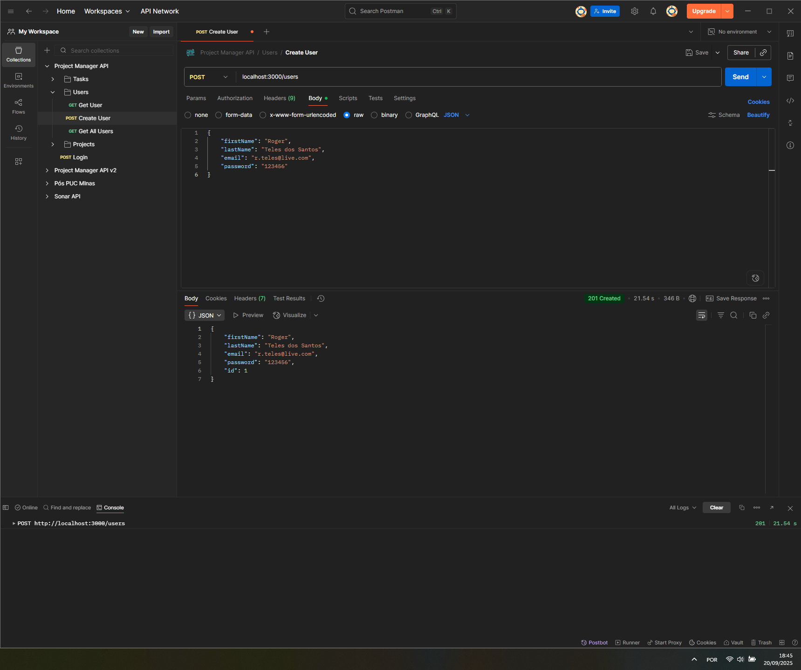

# Pontifícia Universidade Católica de Minas Gerais

**Curso:** Arquitetura de Software Distribuído  
**Disciplina:** Plataforma Node.js  
**Professor:** Samuel Martins  

**Project Manager API**

O projeto final da disciplina consiste em desenvolver um produto de gerenciamento de tarefas como mostra o desenho arquitetural de alto nível acima.
 
Este projeto será subdividido em etapas, onde cada etapa será representada por uma branch própria, sendo:
- [**Atividade 1:**](docs/Atividade01/Atividade01.pdf) Setup do ambiente de desenvolvimento e modelagem inicial dos dados. 
- [**Atividade 2:**](docs/Atividade02/Atividade02.pdf) Implementação da aplicação de gerenciamento de projetos utilizando a Arquitetura CLEAN, juntamente com a persistência utilizando o padrão repository.
- [**Atividade 3:**](docs/Atividade03/Atividade03.pdf) Implementação da autenticação no módulo de usuários, juntamente com um sistema de cache.
- [**Atividade 4:**](docs/Atividade04/Atividade04.pdf) Conversão da aplicação para uma arquitetura baseada em micro-serviços, utilizando o padrão Pub/Sub do Redis. Iremos extrair o módulo de Tasks da nossa base de código e colocá-lo em um pacote separado, onde este irá rodar separadamente da aplicação. O modelo utilizado será o de monorepos, uma vez que conseguimos aproveitar algumas vantagens desse modelo em comparação com o de multi-repositórios.

**C4 Architecture** — Project Manager API

**C4 Architecture** — Project Manager API — Tasks

### Evidências de Testes ###

[Collection do Postman](docs/ProjectManagerAPI.postman_collection.json)

**Estrutura do projeto** 

**Hello World**

**Create User**

**Get User**

**Get All Users**

**Create Project**

**Get Project**

**Get All Projects**

**Create Task**

**Get Task**

**Get All Tasks**

### Autenticação ###
**Create User**

**Login**

**Set Bearer Token in Postman**

**Get User — Authenticated**

**Get All Users — Authenticated**

**Create Project — Authenticated**

**Get Project — Authenticated**

**Get All Projects — Authenticated**

**Create Task — Authenticated**

**Get Task — Authenticated**

**Get All Tasks — Authenticated**

### Database ###

**Users**

**Projects**

**Tasks**

### Comunicação entre micro serviços com Redis ###

**Create Task**

**Update Task**

**Get Task**

**Get All Tasks**

**Redis**
